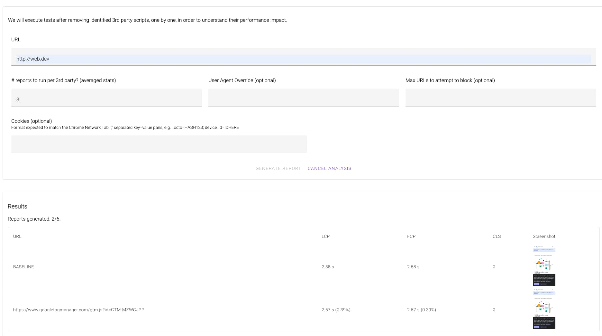

Copyright 2022 Google LLC

Licensed under the Apache License, Version 2.0 (the "License");
you may not use this file except in compliance with the License.
You may obtain a copy of the License at

    https://www.apache.org/licenses/LICENSE-2.0

Unless required by applicable law or agreed to in writing, software
distributed under the License is distributed on an "AS IS" BASIS,
WITHOUT WARRANTIES OR CONDITIONS OF ANY KIND, either express or implied.
See the License for the specific language governing permissions and
limitations under the License.

# Tagspeed Audit



## Introduction
Tagspeed Audit is a tool to help measure the impact third-party JavaScript is
having on pagespeed.

Third-party JavaScript, much of which is delivered via a tag management system,
is a well known culprit when it comes to poor page performance. Although tag
management systems make it easy for non-technical people to deploy complex
measurement features to websites, they don't often provide any insights into
what impact those features are having on overall performance. This can lead to
tens of megabytes of JavaScript being added to sites, resulting in slower
load times and poor interactivity. 

Tagspeed Audit provides a way for non-technical users to measure the performance
impact of individual scripts on a page, based on the [Core Web
Vitals](https://web.dev/vitals/) metrics. 

## Building and Deploying

The tool has a client server architecture, hence the existence of the `server` and `ui` folders.

The server is in NodeJS, and the UI is built in Angular.

### Building
```
cd server
npm install
npm run build

cd ui
npm install
npm run build
```

### Running 
```
cd server
npm run start

cd ui
npm run start
```

### Tests 
```
cd server
npm test

cd ui
npm test
```
 